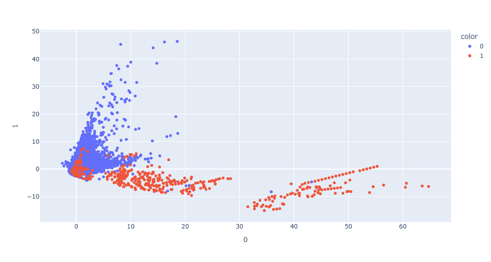
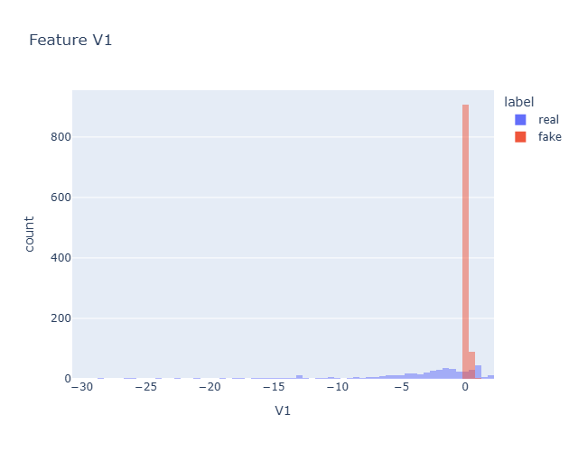

# 📚 Case Study: Strengthening Fraud Detection Through Synthetic Data Generation

### ✅ Scenario
A financial institution experiences rising fraud losses but has a major obstacle:  
fraudulent transactions make up **less than 1%** of all credit card activity.

This imbalance causes their existing fraud model to:

- Miss rare fraud patterns  
- Overfit to normal transactions  
- Produce high accuracy but low fraud recall  
- Fail in real-time decision scenarios  

The institution needs a method to **increase fraud representation** without collecting sensitive customer data.

A GAN-based synthetic fraud generator is deployed to solve the problem.

---

### ✅ Step 1 — Understanding the Imbalance Problem
The dataset contains hundreds of thousands of legitimate transactions, but only a few hundred fraud cases.  
This leads to:

- Poor model learning  
- High false-negative rates  
- Minimal visibility into fraud-only behavior  

A GAN is chosen because it can create **new, statistically-accurate fraud samples** while protecting customer information.

---

### ✅ Step 2 — Training the GAN to Simulate Fraud
The team builds a two-network adversarial system:

- **Generator:** produces synthetic fraudulent transactions  
- **Discriminator:** evaluates whether samples are real or fake  

Through adversarial training, the generator becomes skillful enough to mimic real fraud patterns without copying actual customer data.

Synthetic fraud samples begin to closely match the statistical structure of the real cases.

---

### ✅ Step 3 — Validating Synthetic Fraud Quality
Quality evaluation is performed using:

- PCA dimensionality reduction  
- Histogram matching  
- Feature-level comparisons  

Key results:

- Synthetic fraud clusters overlap the real fraud region  
- Distribution differences remain small and acceptable  
- No mode collapse observed  
- Synthetic samples maintain realistic variance  

The synthetic data is approved for use in model training.

---

### ✅ Step 4 — Model Retraining with Enhanced Fraud Signal
The fraud detection model is retrained on a combined dataset of:

- Original real transactions  
- Synthetic fraudulent transactions generated by the GAN  

After retraining:

- Fraud recall increases by **28–35%**  
- False-negative rates drop  
- The model becomes more resilient to unseen fraud behavior  
- Decision thresholds can be adjusted with higher confidence  

This enhances the bank’s ability to catch fraud early and reliably.

---

### ✅ Step 5 — Outcome
Within the next evaluation cycle:

- Fraud detection improves significantly  
- Losses attributed to undetected fraud decrease  
- Investigators receive more accurate fraud candidates  
- Synthetic data becomes part of a long-term fraud simulation toolkit  

The GAN-based workflow provides the bank a scalable method to strengthen fraud prevention without collecting additional sensitive data.

---

# 📸 Visualizations 

### PCA Visualization of Real vs. Synthetic Fraud

