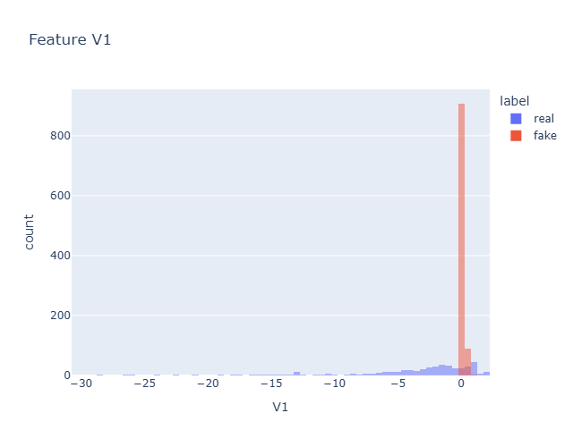

# Credit Card Fraud Detection using GANs

## Project Overview

This project implements a Generative Adversarial Network (GAN) to detect and analyze fraudulent credit card transactions. GANs are used to generate synthetic fraudulent data points, enabling a more balanced dataset for training machine learning models. The project demonstrates the power of GANs in combating real-world issues like fraud detection where data imbalance is a significant challenge.

## Accomplishments

1. **Built and Trained a GAN**:
   - Created a generator to produce synthetic fraudulent data points.
   - Designed a discriminator to distinguish between real and synthetic data.
   - Combined the generator and discriminator to form a complete GAN model.

2. **Visualized Synthetic Data**:
   - Used PCA to reduce dimensionality and visually compare synthetic and real data.
   - Highlighted the differences and similarities between synthetic and real data distributions.

3. **Monitored and Evaluated GAN Performance**:
   - Monitored the GAN's performance during training to ensure meaningful synthetic data generation.
   - Compared individual feature distributions of synthetic and real data.

4. **Analyzed Data with Plots**:
   - Generated interactive and static visualizations to showcase feature distributions and GAN outputs.

---

## Key Components

### GAN Architecture
The GAN consists of:
- **Generator**: A neural network designed to generate synthetic fraudulent data points.
- **Discriminator**: A neural network trained to distinguish between real and synthetic data.

### Training and Evaluation
- The GAN was trained using a dataset of credit card transactions.
- The trained generator was used to produce synthetic fraudulent data, which was then compared against the real data.

### Visualizations
The project includes various visualizations for evaluating the model's performance.

#### PCA Visualization of Real vs Synthetic Data

#### Feature Distribution Comparison
Feature distributions of real and synthetic data are compared using histogram plots to ensure the generator produces realistic outputs.

---

## Tools and Technologies Used

- **Programming Language**: Python
- **Libraries**: TensorFlow, Keras, NumPy, Pandas, Matplotlib, Seaborn, Plotly
- **Machine Learning Techniques**: Generative Adversarial Networks (GANs), PCA
